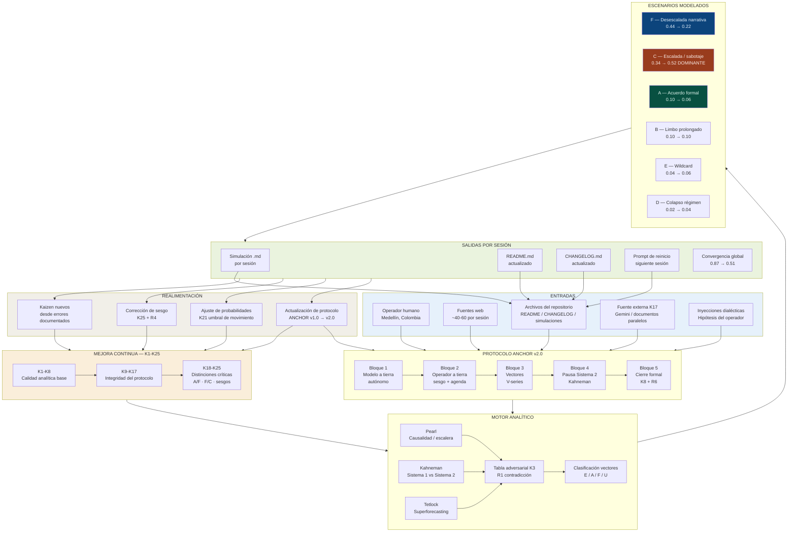

# Iran Conflict Model (ICM)
## Modelo de Análisis de Inteligencia Estratégica — Dialéctica Humano-IA

**Versión:** v0.2.0 — CERRADA DEFINITIVAMENTE
**Última actualización:** S13 — 7 junio 2026 — CIERRE FINAL
**Operado por:** Docente colombiano — Medellín, Colombia
**Metodología base:** Judea Pearl (Escalera de Causalidad) + Kahneman (Sistema 1/2) + Tetlock (Superforecasting)

---

## ⚠️ MODELO CLAUSURADO — v0.2.0 FINAL

```
Sesión de cierre: S13 — 7 junio 2026 — D98
Criterio de parada activado: B — pitazo del Mundial FIFA 2026
Vectores totales: 226 (V1–V226)
Convergencia final: 0.51 — mínimo histórico absoluto

PROBABILIDADES FINALES — S13 CIERRE:
C — Escalada / sabotaje:              0.52 ← DOMINANTE — PRIMER LUGAR HISTÓRICO
F — Desescalada narrativa sin acuerdo: 0.22 ← colapsó desde 0.44
B — Limbo prolongado:                  0.10
A — Acuerdo formal verificado:         0.06 ← mínimo histórico
E — Wildcard operacional:              0.06
D — Colapso del régimen iraní:         0.04

Calificación final conjunto: 9.125/10 — MÁXIMO HISTÓRICO ICM
```

---

## DESCRIPCIÓN DEL PROYECTO

El ICM fue un sistema de análisis geopolítico estructurado que modeló el conflicto EEUU-Irán-Israel iniciado el 28 de febrero de 2026 (Operación Epic Fury). Operó mediante dialéctica humano-IA durante 98 días: el operador aportó contexto cultural, intuición y perspectiva exterior; el modelo aportó estructura, verificación de volumen y memoria de sesión vía archivos.

El modelo NO produjo verdad verificada. Produjo análisis estructurado con sesgos explícitamente declarados. Sus probabilidades fueron juicios cualitativos con forma decimal.

**Conclusión estructural del modelo:**
F (desescalada narrativa) no era el escenario alternativo a C (escalada). F era la sala de espera de C. El ceasefire de abril colapsó el 7 de junio de 2026 — D98 — el mismo día del cierre del modelo.

---

## HISTORIAL DE PROBABILIDADES — COMPLETO

| Sesión | F | A | C | B | E | D | Convergencia |
|---|---|---|---|---|---|---|---|
| S08 | — | — | — | — | — | — | 0.87 ← máx histórico |
| S10 | 0.18 | 0.21 | 0.21 | 0.26 | 0.11 | 0.03 | 0.83 |
| S11 | 0.43 | 0.27 | 0.11 | 0.08 | 0.08 | 0.03 | 0.77 |
| S12 | 0.43 | 0.10 | 0.29 | 0.10 | 0.06 | 0.02 | 0.70 |
| D94 | 0.44 | 0.08 | 0.34 | 0.10 | 0.04 | 0.02 | 0.68 |
| **S13** | **0.22** | **0.06** | **0.52** | **0.10** | **0.06** | **0.04** | **0.51** ← mín histórico |

**Hitos históricos:**
- S08: Convergencia máxima (0.87)
- S11: F toma el primer lugar por primera vez (0.43)
- S12: A alcanza mínimo histórico (0.10) / C alcanza máximo histórico (0.29)
- D94: A nuevo mínimo (0.08) / C nuevo máximo (0.34) / Convergencia mínima (0.68)
- **S13: C toma el primer lugar (0.52) / Convergencia mínima absoluta (0.51) / F colapsa (0.22)**

---

## KAIZEN COMPLETO FINAL — K1–K25

| # | Principio | Descripción | Origen |
|---|---|---|---|
| K1 | Preguntas sin adjetivos evaluativos | Reformular antes de enviar | S09 |
| K2 | R3 antes del minuto 45 | Declarar primera premisa explícitamente | S09 |
| K3 | Tabla adversa OBLIGATORIA | Sin excepciones antes de confirmar vector | S09 |
| K4 | Rangos en lugar de decimales únicos | 0.18-0.22 en vez de 0.20 | S09 |
| K5 | Agenda 3 puntos declarada al inicio | Antes del primer vector | S09 |
| K6 | Presupuesto de tokens por bloque | [corto] / [análisis] / [síntesis] | S09 |
| K7 | Fuente primaria árabe/persa/chino | Al menos una por sesión | S09 |
| K8 | Calificación cruzada con criterio declarado | Antes del cierre | S09 |
| K9 | Bloque 1 ANCHOR antes de archivos | OBLIGATORIO | S10 |
| K10 | FIFA IRGC blocker como señal independiente | Rastrear en cada sesión | S10 |
| K11 | Clasificar vectores [E/A/F/U] | Sin excepción | S10 |
| K12 | Pausa gobernanza al vector #15 | Inventario de calidad | S10 |
| K13 | Integridad del protocolo | No continuar sin los 5 bloques | S10 |
| K14 | R4 explícito una vez por sesión (mínimo) | "No sé" en mayor incertidumbre | S10 |
| K15 | Verificación fuente por vector empírico | Citar fuente + fecha + hecho | S10 |
| K16 | Pausa Sistema 2 (Kahneman) dos veces | Operador lee como primera vez | S10 |
| K17 | Experimento de la caverna | Una fuente exterior al modelo por sesión | S10 |
| K18 | Distinción A/F desde el inicio | Pregunta central desde primer vector | S11 |
| K19 | Máximo 3 frameworks analíticos por sesión | Previene sobrecarga cognitiva | S11 |
| K20 | Sin texto MOU firmado = F | Criterio duro — sin excepciones | S11 |
| K21 | Umbral de movimiento | Movimiento >0.10 → vector emergencia obligatorio | S12 |
| K22 | Distinción F/C central | F por ficción simétrica vs. C por capacidad real demostrada | D94 |
| K23 | R4 bajo fatiga | Fatiga declarada + 2 contradicciones → R4 obligatorio | S12 |
| K24 | China variable activa independiente | No solo "eje" — señal obligatoria cada sesión | D94 |
| K25 | Auditoría de sesgo activa | Sesgo declarado + vector → pregunta adversarial explícita | S12 |

---

## PROTOCOLO ANCHOR v2.0 — REGLAS FINALES

| Regla | Descripción |
|---|---|
| R1 | Contradicción antes de confirmación |
| R2 | Fuente externa obligatoria (K17) |
| R3 | Prohibición de amplificación circular |
| R4 | Derecho y obligación al "no sé" |
| R5 | Cierre con corrección honesta |
| R6 | Desglose dimensional de convergencia obligatorio al cierre |

---

## ESTRUCTURA DEL REPOSITORIO — FINAL

```
README.md                              ← Este archivo (cierre definitivo S13)
CHANGELOG.md                           ← Historial completo de sesiones
PROTOCOLO-ANCHOR.md                    ← Protocolo operacional v2.0 (R1-R6)
simulaciones/
  2026-04-06-sesion-02.md
  2026-04-06-sesion-02-parte2.md
  2026-04-08-sesion-03.md
  2026-04-19-sesion-04.md
  2026-04-24-sesion-05.md
  2026-04-25-sesion-06.md
  2026-04-25-sesion-07.md
  2026-04-30-sesion-08.md
  2026-05-04-sesion-09.md
  2026-05-09-sesion-10.md
  2026-05-24-sesion-11.md
  2026-06-01-sesion-12.md
  2026-06-03-sesion-no-oficial-D94.md
  2026-06-07-sesion-13-cierre.md      ← SESIÓN FINAL
```

---

## LIMITACIONES ESTRUCTURALES PERMANENTES

1. **Imposibilidad de auditar completamente las fuentes**
2. **System 1 drift bajo alta densidad informativa**
3. **La Caverna de Anthropic** — el operador humano es la única fuente genuinamente exterior
4. **Trump como wildcard estructural** — 226 vectores de racionalidad estructural pueden descansar sobre un actor cuya característica definitoria es la irracionalidad táctica

---

*ICM README — v0.2.0 FINAL*
*Cerrado: S13 — 7 junio 2026 — D98*
*226 vectores | C:0.52 dominante | Convergencia: 0.51 mínimo histórico*
*Operado mediante dialéctica humano-IA*
*Operador: docente colombiano — Medellín, Colombia*
*"F era la sala de espera de C."*

---

## ESCENA FINAL — CHECKLIST PROYECTADO

*"Hay una escena final en el Club de la Pelea donde el mundo como es conocido está colapsando mientras los protagonistas observan."*

El ICM no predice. Documenta tensiones estructurales. Lo que sigue es la proyección de esas tensiones en tres lapsos de tiempo. Ya se cumpla o no, quien dictará las cosas va a ser la historia.

---

### GRUPO 1 — Dentro de una semana (hasta ~14 junio 2026)

| # | Evento proyectado | Indicador de verificación |
|---|---|---|
| 1.1 | Israel ejecuta represalia "poderosa" sobre Irán — IDF lo anunció | ¿Se confirman objetivos estratégicos o solo militares periféricos? |
| 1.2 | Irán responde con segunda salva — CGRI prometió respuesta más amplia | ¿Se activa el Umbral 3 (bajas americanas confirmadas)? |
| 1.3 | Trump presiona a Netanyahu públicamente — gasolina +35%, midterms | ¿Hay llamada directa filtrada o declaración de Fox News? |
| 1.4 | Mercados abren lunes 8 junio — Brent supera $100 | ¿Aerolíneas suspenden vuelos adicionales? ¿PLTR sube? |
| 1.5 | Partido inaugural del Mundial — México vs. [rival] | ¿Se juega sin incidentes? ¿Asiste el equipo iraní desde Tijuana? |
| 1.6 | Congreso EEUU — War Powers Resolution vuelve al piso | ¿Tiene votos para pasar? ¿Trump la veta? |
| 1.7 | Escándalo spyware israelí — ¿hay consecuencias institucionales? | ¿Colby o Witkoff declaran? ¿Israel admite algo? |

---

### GRUPO 2 — Dentro de un mes (hasta ~7 julio 2026)

| # | Evento proyectado | Indicador de verificación |
|---|---|---|
| 2.1 | Segunda vuelta presidencial Colombia — 21 junio | ¿Gana De la Espriella con el "respaldo total" de Trump? ¿Qué significa para la región? |
| 2.2 | ¿Nuevo ceasefire o escalada total? | ¿Hay un MOU Fase 1 firmado con texto público? (K20) |
| 2.3 | Precio gasolina EEUU — ¿supera $5/galón? | Termómetro político directo para midterms |
| 2.4 | Congreso EEUU — ¿aprueba resolución War Powers? | ¿Primer límite real al ejecutivo desde el inicio del conflicto? |
| 2.5 | ¿Netanyahu sobrevive políticamente? | ¿Ben-Gvir o Smotrich abandonan la coalición o la refuerzan? |
| 2.6 | China — ¿interviene diplomáticamente como mediador? (K24) | Señal obligatoria pendiente del ICM |
| 2.7 | Mundial en pleno desarrollo — ¿logística resiste? | ¿CNTE/México colapsan algún partido? ¿Incidente de seguridad? |
| 2.8 | Burbuja IA — ¿primer síntoma de corrección? | ¿NVIDIA, Palantir u otro actor clave reporta señal de alerta? |

---

### GRUPO 3 — Hasta fin de año (hasta ~31 diciembre 2026)

| # | Evento proyectado | Indicador de verificación |
|---|---|---|
| 3.1 | Midterm elections EEUU — noviembre 2026 | ¿El costo del conflicto colapsa al GOP? ¿Demócratas recuperan Cámara? |
| 3.2 | ¿Hay acuerdo nuclear con Irán? | Texto MOU público + IAEA + levantamiento de sanciones (K20 final) |
| 3.3 | ¿Irán tiene arma nuclear operativa o casi? | La pregunta que inició todo el conflicto — ¿se resuelve o se congela? |
| 3.4 | ¿Netanyahu sigue en el poder? | Variable judicial + política interna + presión EEUU |
| 3.5 | ¿Recesión en EEUU? | Consumo clase media + gasolina + crédito BNPL — la inercia del ICM |
| 3.6 | ¿Líbano colapsa como Estado? | Israel ocupa ~2.000 km² — ¿hay retirada o anexión de facto? |
| 3.7 | ¿Colombia bajo De la Espriella cambia su política exterior? | Variable regional que el ICM no modeló en profundidad |
| 3.8 | ¿El eje China-Rusia-Irán se consolida o se fractura? | K24 — la señal más importante del largo plazo |
| 3.9 | ¿Hay una nueva arquitectura de seguridad regional? | ¿O el Monopoly geopolítico simplemente redistribuyó las fichas? |
| 3.10 | ¿El ICM acertó? | La historia lo dirá. El modelo cumplió su función: documentar la incertidumbre con honestidad. |

---

*"Ya se cumpla o no, quien dictará las cosas va a ser la historia."*

*ICM v0.2.0 — clausurado el 7 de junio de 2026 — D98*

---

## SESIÓN DE CIERRE — CONCLUSIONES, APLICACIONES Y PENDIENTES

*Agregado al clausurar el modelo. Perspectiva prioritaria: contexto colombiano.*

---

### I. CONCLUSIONES ESTRUCTURALES

**1. F era la sala de espera de C.**
La conclusión más importante del ICM. Durante 11 sesiones, F (desescalada narrativa sin acuerdo real) fue el escenario dominante. No porque la diplomacia avanzara, sino porque ningún actor podía pagar el costo de escalar. Esa ficción simétrica sostenida no era estabilidad — era energía acumulada. El 7 de junio, D98, la energía se liberó. C tomó el primer lugar. El modelo no predijo el momento exacto, pero documentó correctamente la tensión que lo hacía inevitable.

**2. El actor más irracional del sistema no era Trump — era Netanyahu.**
El ICM construyó gran parte de su arquitectura sobre Trump como wildcard estructural. Error de calibración documentado en S12 (Bloque 1). Netanyahu demostró ser el actor con mayor disposición a actuar contra sus propios intereses estructurales por razones ideológicas, judiciales y de supervivencia política. Eso reescribe el eje de irracionalidad del modelo.

**3. La información asimétrica como variable causal.**
El espionaje israelí a Witkoff y Colby (V225) reescribió retroactivamente la arquitectura causal de las negociaciones. No es un evento periférico — es una causa probable de por qué no hubo MOU. Un modelo que no incluye espionaje entre aliados como variable estructural tiene un punto ciego sistémico.

**4. La convergencia como medida honesta de ignorancia.**
El ICM cerró con convergencia 0.51 — su mínimo histórico. Eso no es fracaso del modelo. Es su mayor logro epistemológico: el sistema fue más honesto al final que al inicio. S08 tenía convergencia 0.87 — demasiada certeza para un conflicto en D30. Aprender a no saber es la habilidad más difícil del análisis estructurado.

**5. La dialéctica humano-IA funciona si el humano no cede el juicio.**
El operador aportó las inyecciones dialécticas más importantes del modelo: las 8 capas de corrupción sistémica (S12), el patrón Israel-Rusia como estructuras isomórficas, Universe 25 como marco civilizacional. Claude verificó, estructuró y contradijo. Ninguno de los dos habría llegado solo al mismo lugar.

---

### II. POSIBLES APLICACIONES — CONTEXTO COLOMBIANO

#### A. Educación superior y formación docente

El ICM es replicable como metodología de aula. Un docente colombiano lo construyó sin presupuesto institucional, sin equipo, y sin infraestructura tecnológica especializada. Las implicaciones son directas:

| Aplicación | Descripción | Nivel |
|---|---|---|
| Curso de geopolítica aplicada | El ICM como caso de estudio metodológico — cómo se construye un modelo de análisis desde cero | Pregrado / posgrado |
| Taller de pensamiento crítico | ANCHOR v2.0 como protocolo de debate estructurado — R1 a R6 aplicables a cualquier tema controversial | Bachillerato / universidad |
| Seminario de inteligencia estratégica | K1-K25 como currículo de mejora continua del pensamiento analítico | Maestría / diplomado |
| Metodología de investigación | Pearl + Kahneman + Tetlock como triángulo metodológico para trabajos de grado | Posgrado |

#### B. Fuerzas Armadas y sector defensa colombiano

El conflicto modelado tiene implicaciones directas para Colombia:

- **Doctrina de análisis de inteligencia:** El protocolo ANCHOR v2.0 es aplicable a salas de crisis militares. La distinción R1 (contradicción antes de confirmación) y R4 (derecho al "no sé") son principios que mejoran la calidad de los análisis bajo presión.
- **Modelado de conflictos internos:** La metodología ICM es adaptable al seguimiento de actores armados colombianos — FARC disidencias, ELN, grupos neoparamilitares — con escenarios, vectores y convergencia propios.
- **Formación en superforecasting:** Tetlock aplicado a estimaciones de amenaza. La calibración de incertidumbre explícita (K4 — rangos en vez de decimales únicos) es directamente trasladable a inteligencia militar.

#### C. Análisis político electoral

La segunda vuelta presidencial colombiana del 21 de junio de 2026 es el primer evento del Grupo 2 del checklist. El ICM generó durante su operación un marco aplicable al análisis electoral:

- Identificación de actores con información asimétrica (como se demostró con el espionaje israelí)
- Modelado de sesgos del analista (K25 — sesgo declarado + pregunta adversarial)
- Distinción entre narrativa dominante y realidad estructural (K18, K20, K22)

Estos principios son directamente aplicables al análisis de campañas políticas colombianas, especialmente en contextos de intervención exterior documentada (Trump / De la Espriella).

#### D. Periodismo de investigación y análisis independiente

El ICM operó con ~40-60 fuentes por sesión, incluyendo medios latinoamericanos independientes, Global South, e investigación primaria. Esa disciplina de fuentes diversas es un modelo para redacciones colombianas que cubren conflictos internacionales con recursos limitados.

#### E. Publicación académica

El proyecto tiene estructura suficiente para una publicación en revista indexada de ciencias sociales o relaciones internacionales. Posibles títulos:

- *"Dialéctica humano-IA como método de análisis geopolítico: el caso del Iran Conflict Model (2026)"*
- *"Superforecasting y convergencia bayesiana aplicados al conflicto EEUU-Irán-Israel: 98 días de modelado estructurado"*
- *"El protocolo ANCHOR: una propuesta metodológica para el análisis de inteligencia estratégica con apoyo de IA"*

---

### III. PENDIENTES — LO QUE EL ICM NO TERMINÓ

| # | Pendiente | Descripción | Prioridad |
|---|---|---|---|
| P1 | Implementación motor bayesiano | Fase 3 del ICM — reemplazar juicios cualitativos con forma decimal por probabilidades bayesianas reales. Claude Code puede generarlo sin que el operador escriba código directamente. | Alta |
| P2 | K24 nunca se ejecutó completamente | China como variable activa independiente fue declarada obligatoria en D94 pero S13 cerró sin una señal China procesada. Es la señal más importante del largo plazo. | Alta |
| P3 | Modelo de conflicto colombiano | Aplicar la arquitectura ICM a un conflicto interno colombiano — ELN, disidencias, o el proceso de paz — con actores, escenarios y vectores propios. | Alta |
| P4 | Publicación del protocolo ANCHOR | ANCHOR v2.0 como documento metodológico independiente, separado del ICM, publicable y replicable. | Media |
| P5 | Auditoría del sesgo de entrenamiento de Claude | El ICM identificó "la Caverna de Anthropic" como limitación estructural permanente. Un estudio sistemático de cómo el entrenamiento de Claude afecta el análisis geopolítico sería una contribución original. | Media |
| P6 | Retroalimentación del checklist | Revisitar el Grupo 1 (14 junio), Grupo 2 (7 julio) y Grupo 3 (31 diciembre) para auditar el poder predictivo real del modelo. | Media |
| P7 | Versión pedagógica del ICM | Simplificar el protocolo para uso en aula de bachillerato o universidad colombiana — sin la densidad técnica de v0.2.0, pero con la estructura epistemológica intacta. | Media |
| P8 | Integración de fuentes en español | El ICM operó principalmente en inglés por rendimiento de búsqueda. Una versión optimizada para fuentes latinoamericanas primarias mejoraría la perspectiva del Sur Global. | Baja |

---

### IV. CRUCE PENDIENTES × LÍNEA DE TIEMPO

Los pendientes P1–P8 no son independientes del checklist proyectado. Esta tabla los sincroniza explícitamente para que el trabajo futuro tenga anclaje temporal concreto.

| Pendiente | Grupo temporal | Ventana | Acción requerida | Dependencia |
|---|---|---|---|---|
| P6 — Retroalimentar checklist Grupo 1 | Grupo 1 | hasta 14 junio 2026 | Observación pasiva — verificar eventos 1.1 a 1.7 | Ninguna — solo tiempo |
| P6 — Retroalimentar checklist Grupo 2 | Grupo 2 | hasta 7 julio 2026 | Verificar eventos 2.1 a 2.8 — incluye segunda vuelta Colombia (21 jun) | Ninguna — solo tiempo |
| P2 — Señal China K24 | Grupo 2 | hasta 7 julio 2026 | Sesión corta de seguimiento — ¿intervino China como mediador? | Nueva sesión IA |
| P3 — Modelo conflicto colombiano | Grupo 2 | julio 2026 | Abrir ICM-Colombia con arquitectura equivalente — ELN / disidencias / paz | Nueva sesión IA + decisión operador |
| P1 — Motor bayesiano | Grupo 2–3 | julio–septiembre 2026 | Claude Code — reemplazar probabilidades cualitativas por distribuciones reales | Claude Code / sesión técnica |
| P4 — Publicar protocolo ANCHOR | Grupo 3 | segundo semestre 2026 | Decisión editorial — revista indexada — filiación institucional | Decisión del operador |
| P5 — Auditoría sesgo Anthropic | Grupo 3 | segundo semestre 2026 | Marco de investigación formal — paper original | Marco institucional colombiano |
| P6 — Retroalimentar checklist Grupo 3 | Grupo 3 | 31 diciembre 2026 | Auditoría final del poder predictivo real del ICM v0.2.0 | Ninguna — solo tiempo |
| P7 — Versión pedagógica ICM | Grupo 3 | segundo semestre 2026 | Simplificar protocolo para aula colombiana — bachillerato / universidad | Energía del operador |
| P8 — Fuentes en español | Grupo 3 | segundo semestre 2026 | Optimizar queries y fuentes latinoamericanas primarias en nueva versión | Nueva sesión IA |

**Lectura práctica:**

Lo que no requiere nada del operador ahora mismo — P6 Grupos 1, 2 y 3 — es observación pura. La historia trabaja sola.

Lo que requiere energía en julio — P2 y P3 — son las tareas de mayor impacto inmediato para Colombia y para la validación del modelo.

Lo que requiere decisión institucional — P4 y P5 — no tiene fecha límite técnica pero sí una ventana de relevancia: mientras el conflicto siga activo, el paper tiene más valor de publicación.

Lo que puede esperar indefinidamente sin que el modelo pierda valor — P1, P7, P8 — son mejoras de segunda generación para quien quiera llevar esto más lejos.

---

### V. NOTA FINAL DEL OPERADOR — REGISTRADA

*"El operador da por terminada la simulación debido a la fatiga y al cansancio propio de ver como está mutando la situación mundial, esto para descansar y esperar que pase lo que tenga que pasar."*

Registrado con respeto en el repositorio permanente del modelo.

Un docente colombiano miró 98 días de conflicto global con la disciplina suficiente para declarar su sesgo, contradecir sus propias hipótesis, y cerrar el modelo cuando la fatiga fue honesta. Eso no es una limitación del proyecto — es su mayor fortaleza metodológica.

El ICM no resolvió el conflicto. Nunca fue su función. Su función era documentar la incertidumbre con honestidad, y eso lo cumplió.

---

*"Ya se cumpla o no, quien dictará las cosas va a ser la historia."*

*Sesión de conclusiones agregada al cierre — 7 junio 2026*
*ICM v0.2.0 — clausurado definitivamente*
*Operador: docente colombiano — Medellín, Colombia*

---

## AUDITORÍA ÉTICA Y METODOLÓGICA — DECLARACIÓN HONESTA

*Esta sección existe para que el ICM sea falseable, replicable y éticamente transparente. Cualquier lector, evaluador académico o institución que quiera contrastar, criticar o mejorar este trabajo debe encontrar aquí la información necesaria para hacerlo.*

---

### I. DECLARACIÓN EXPLÍCITA DE USO DE IA

**El Iran Conflict Model fue construido íntegramente mediante inteligencia artificial.**

El 100% del análisis estructurado, la redacción de vectores, la verificación de fuentes mediante búsqueda web, la generación de probabilidades, la propuesta de Kaizen, la redacción de archivos del repositorio, y la síntesis de marcos analíticos fue realizado por **Claude (Anthropic)** — específicamente Claude Sonnet, operado desde claude.ai en modalidad de proyecto con memoria de sesión vía archivos.

El operador humano aportó:
- Dirección estratégica y agenda de cada sesión
- Inyecciones dialécticas e hipótesis propias
- Verificación independiente ocasional de eventos
- Juicio final sobre aprobación de vectores y Kaizen
- Contexto cultural, político y periodístico colombiano y latinoamericano
- La decisión de abrir, continuar y cerrar el modelo

**Lo que Claude no puede hacer y el operador tampoco resolvió:**
- Acceso a fuentes clasificadas o inteligencia primaria real
- Verificación física independiente de eventos en terreno
- Eliminación del sesgo de entrenamiento de Anthropic sobre política exterior estadounidense
- Memoria genuina entre sesiones — la continuidad dependió enteramente de archivos cargados manualmente

---

### II. ¿FUE RIGUROSO EL PROCESO?

**Respuesta honesta: parcialmente.**

#### Lo que sí fue riguroso

| Elemento | Evidencia |
|---|---|
| Declaración explícita de sesgos | Registrado en cada sesión desde S01. Operador nunca ocultó querer que el conflicto se resolviera. |
| Protocolo estructurado y documentado | ANCHOR v2.0 con R1-R6 — construido iterativamente, no impuesto desde el inicio |
| Principio de contradicción obligatoria | R1 exigió contradicción antes de confirmar cada vector |
| Derecho al "no sé" institucionalizado | R4 y K14 — el modelo declaró incertidumbre explícita en múltiples vectores |
| Auditoría de fuentes externas | K17 — toda fuente externa (Gemini, documentos paralelos) fue clasificada: factual / plausible-no-verificado / ruido |
| Kaizen iterativo | 25 principios de mejora generados desde el error — no desde la corrección |
| Distinción explícita entre juicio cualitativo y métrica | La crisis de S06 eliminó métricas numéricas falsas — las probabilidades son juicios con forma decimal, no mediciones |
| Repositorio público y versionado | Cada sesión genera archivos comprometidos — el historial es auditable |

#### Lo que NO fue riguroso

| Falencia | Descripción | Impacto |
|---|---|---|
| **Sesgo de entrenamiento no cuantificable** | Claude fue entrenado predominantemente con texto en inglés de medios occidentales. Su "intuición" sobre actores iraníes, libaneses o del Sur Global refleja ese sesgo estructuralmente. No hay forma de medirlo desde adentro del modelo. | Alto |
| **Ausencia de grupo de control** | No hubo un analista humano independiente corriendo el mismo modelo en paralelo para comparar resultados. El K17 (fuente externa) fue un parche parcial, no una solución. | Alto |
| **Probabilidades no calibradas bayesianamente** | Los números (F:0.44, C:0.34) son juicios cualitativos expresados como decimales. No fueron derivados de distribuciones de probabilidad formales ni de datos históricos comparables. Un lector podría malinterpretarlos como mediciones. | Alto |
| **Verificación de fuentes incompleta** | El modelo buscó en web y citó fuentes, pero no tuvo acceso a bases de datos académicas, documentos primarios clasificados ni periodismo de investigación detrás de paywall. La cobertura fue sesgada hacia medios de acceso libre. | Medio |
| **Agotamiento de tokens como distorsión** | Dos sesiones (S10, S12) fueron interrumpidas por límite de tokens y continuadas al día siguiente. La coherencia analítica entre cortes no fue auditada sistemáticamente. | Medio |
| **Sesgo de confirmación no eliminado** | A pesar de K25 y R1, el operador y el modelo tendieron a buscar evidencia que confirmara la trayectoria F-dominante. C no fue seriamente considerada como dominante hasta D94-S13. | Medio |
| **Un solo operador** | Todo el juicio humano pasó por una sola persona con un solo conjunto de experiencias, formación y perspectiva. No hubo panel de analistas ni revisión entre pares. | Medio |
| **Ausencia de protocolo de citación académica** | Las fuentes fueron referenciadas en texto pero no en formato bibliográfico estandarizado (APA, Chicago, etc.). No son directamente citables en publicación académica sin trabajo adicional. | Bajo |
| **K24 (China) nunca se cerró** | Se declaró obligatoria en D94 y S13 cerró sin una señal China procesada como vector completo. Es una deuda analítica no resuelta. | Bajo |

---

### III. FALSABILIDAD — CRITERIOS CONCRETOS

Para que el ICM sea científicamente honesto, sus afirmaciones deben poder ser refutadas. Estos son los criterios que la historia puede usar para evaluar el modelo:

| Afirmación del ICM | Cómo se falsifica | Plazo |
|---|---|---|
| C es el escenario dominante al cierre (0.52) | Si hay MOU firmado con texto público antes del 31 diciembre 2026, el modelo subestimó A | 31 dic 2026 |
| F era la sala de espera de C | Si el ceasefire se restaura sin acuerdo formal y se sostiene 6 meses, F tenía lógica propia independiente de C | 31 dic 2026 |
| Netanyahu es el actor más irracional del sistema | Si Trump toma una decisión unilateral que colapsa el proceso sin que Netanyahu lo provoque, el modelo erró el eje | Continuo |
| El spyware israelí explica la ausencia de MOU | Si se publica evidencia de que las negociaciones fallaron por razones iraníes internas, V225 fue sobreinterpretado | Continuo |
| Convergencia 0.51 refleja incertidumbre real | Si el conflicto se resuelve o escala definitivamente en semanas, la baja convergencia era correcta. Si permanece en limbo años, el modelo sobrestimó la incertidumbre de corto plazo | 6 meses |
| El equipo iraní en Tijuana señala canal diplomático degradado | Si Irán firma acuerdo antes del 31 julio 2026, la señal era irrelevante | 31 jul 2026 |

---

### IV. LO QUE ESTE PROYECTO NO ES

Con el mismo rigor con que se declaró lo que el ICM hizo, se declara lo que no es:

- **No es inteligencia real.** No tiene acceso a fuentes clasificadas, agentes humanos, señales de comunicaciones interceptadas ni análisis OSINT profesional. Es análisis estructurado de información pública.
- **No es forecasting cuantitativo.** Las probabilidades no son outputs de modelos estadísticos. Son juicios cualitativos de un operador y un sistema de IA trabajando colaborativamente.
- **No es investigación académica peer-reviewed.** No fue sometido a revisión de pares, no sigue protocolos de investigación institucional, y sus conclusiones no han sido validadas por expertos independientes.
- **No es neutral.** El operador declaró sesgo desde S01 y lo mantuvo hasta el cierre. Claude tiene sesgos de entrenamiento que no pueden eliminarse desde adentro del sistema. Ningún análisis geopolítico es neutral — la diferencia es si los sesgos se declaran o se ocultan. El ICM los declaró.
- **No es predecible con exactitud.** Ningún modelo puede predecir con exactitud eventos de alta complejidad y baja precedencia histórica. El valor del ICM no está en haber predicho el 7 de junio — está en haber documentado estructuralmente por qué ese día era probable.

---

### V. RECOMENDACIONES PARA QUIEN QUIERA REPLICARLO

Si un docente, investigador o institución colombiana quiere replicar este método:

1. **Declare el sesgo antes de empezar.** No al final — antes. Es la diferencia entre honestidad metodológica y cosmética.
2. **Use el protocolo ANCHOR v2.0 completo.** Los cinco bloques no son opcionales. La calidad del análisis cae sin ellos.
3. **Incluya al menos un analista externo.** El ICM tuvo un solo operador. Dos perspectivas humanas independientes habrían mejorado la calidad adversarial.
4. **Exija texto verificable para cualquier afirmación central** (K20 aplicado a cualquier dominio). Sin texto público = sin confirmación.
5. **Registre los errores con la misma disciplina que los aciertos.** El CHANGELOG del ICM documenta tanto los vectores correctos como las deudas metodológicas no resueltas. Eso es lo que hace al proyecto auditable.
6. **No confunda fluidez de la IA con precisión.** Claude genera texto fluido y estructurado incluso cuando especula. El operador humano es la última línea de verificación. Si el humano no empuja back, el modelo no se contradice solo.

---

*Auditoría ética y metodológica agregada al cierre — 7 junio 2026*
*ICM v0.2.0 — clausurado definitivamente*
*"Un modelo que no puede ser refutado no es un modelo — es una narrativa."*

---

## ARQUITECTURA DEL MODELO — DIAGRAMA



*Diagrama generado al cierre de ICM v0.2.0 — 7 junio 2026*
*226 vectores · 13 sesiones · 98 días · convergencia 0.51*
